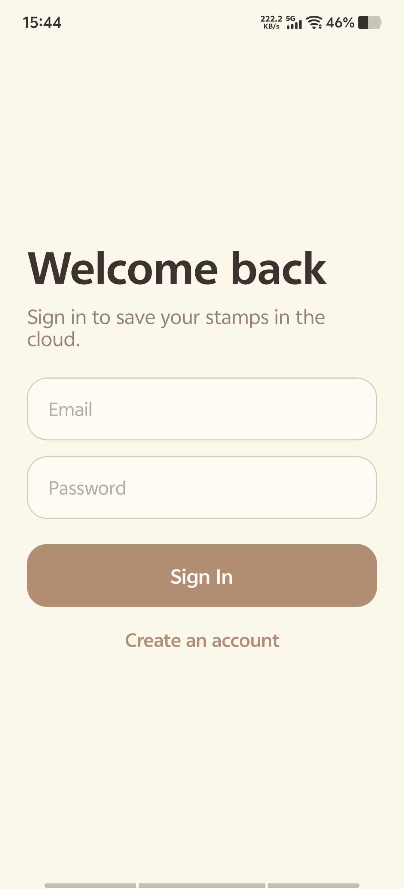
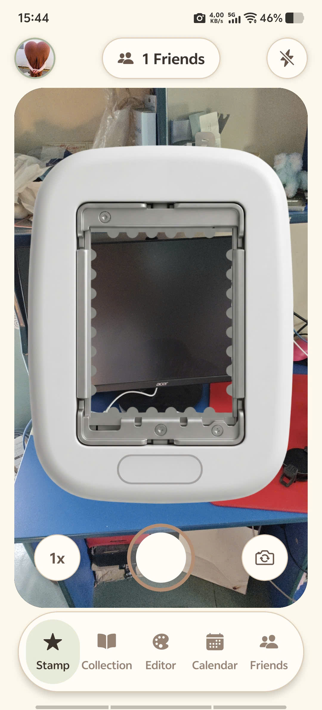
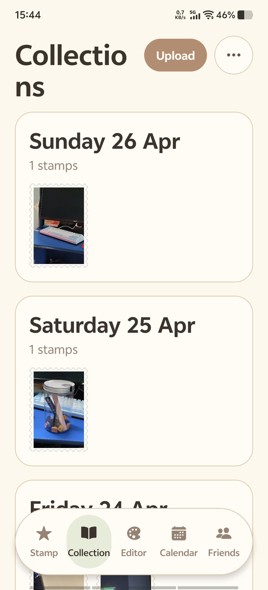
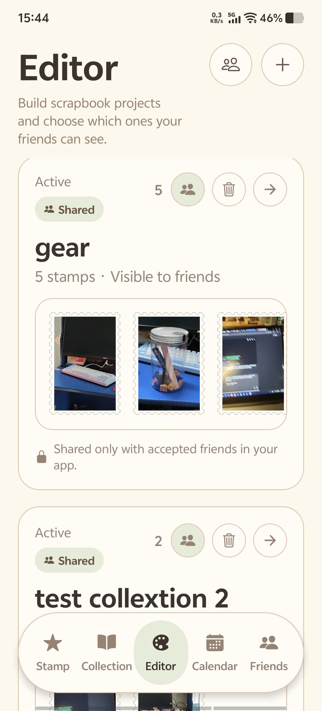
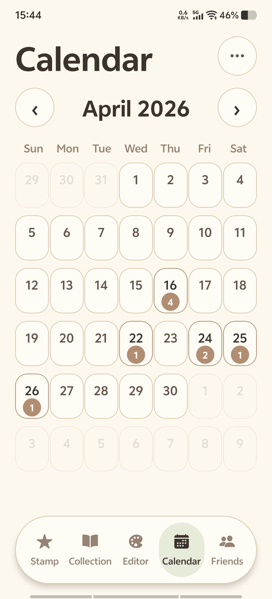
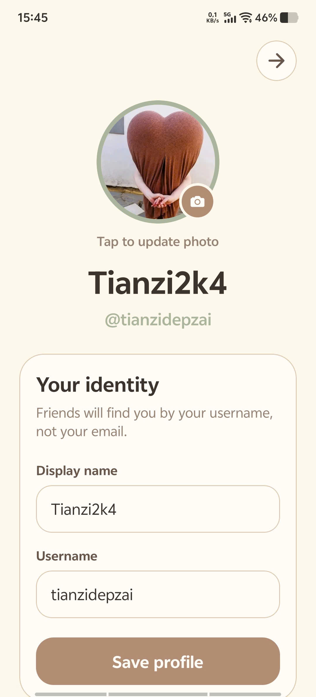
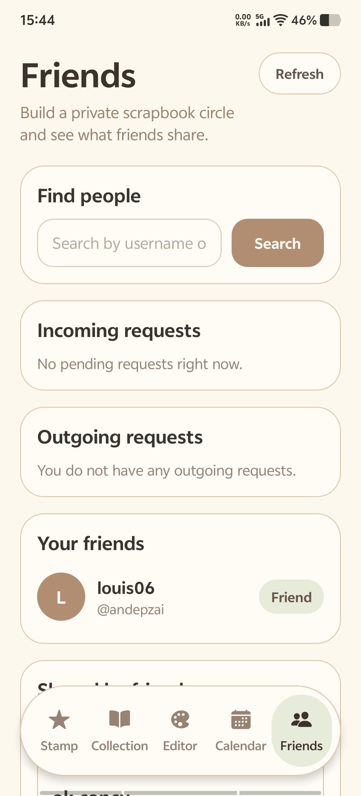
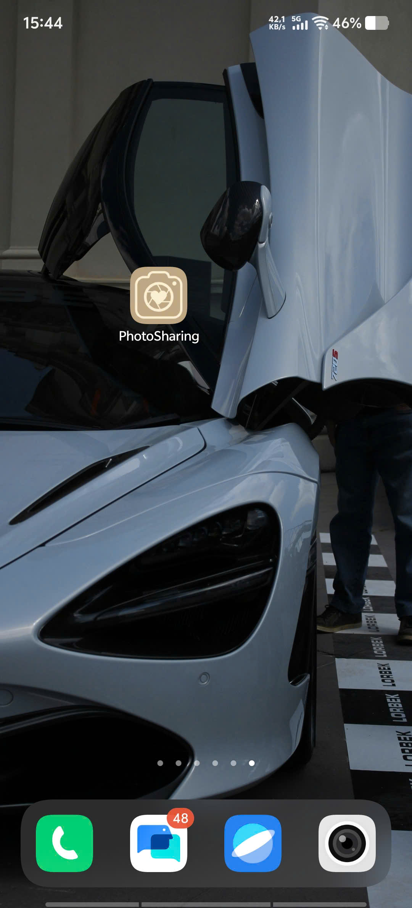

# PhotoSharing

[](#)
[](#license)
[](#tech-stack)

A private, social scrapbook app where users capture "stamps" from camera moments, organize them by day, and design shareable collage projects for friends.

## Table of Contents

- [Project Overview](#project-overview)
- [Key Features](#key-features)
- [Tech Stack](#tech-stack)
- [Getting Started](#getting-started)
- [App Preview](#app-preview)
- [Download APK](#download-apk)
- [Environment Variables](#environment-variables)
- [Available Scripts](#available-scripts)
- [Project Structure](#project-structure)
- [Roadmap](#roadmap)
- [License](#license)

## Project Overview

PhotoSharing is an Expo + React Native application that combines:

- camera-based "stamp" capture,
- cloud upload + persistence,
- scrapbook-like visual editing,
- private friend sharing.

The app uses Supabase for authentication and data, Cloudinary for image uploads, and `expo-router` route groups for auth/protected navigation flows.

## Key Features

- 📸 **Stamp camera workflow** with custom crop/preview behavior and image processing before save.
- 📝 **Stamp review + metadata** flow (title and note) before uploading to cloud.
- 📚 **Book collections** grouped by day, with detailed day and single-stamp views.
- 🗓️ **Calendar view** that highlights dates containing saved stamps.
- 🎨 **Canvas-based editor** for scrapbook projects (stamps, text layers, assets, backgrounds).
- ☁️ **Cloud persistence** for projects, stamps, and profiles via Supabase.
- 🧑‍🤝‍🧑 **Friends system** with search, requests, accept/decline, and private social graph.
- 🔐 **Private sharing controls** to publish/unpublish specific projects to accepted friends.
- 🖼️ **Image upload pipeline** to Cloudinary for stamps, editor assets, and profile avatars.
- 👤 **Auth + profile setup gate** ensuring protected routes only load after setup completion.

## Tech Stack

### Languages

- TypeScript
- JavaScript

### Frameworks & Runtime

- Expo (SDK 54)
- React 19
- React Native 0.81
- Expo Router

### UI & Styling

- NativeWind
- Tailwind CSS
- React Native SVG
- React Native Gesture Handler
- React Native Reanimated

### Data, Auth, and Cloud

- Supabase (`@supabase/supabase-js`)
- Async Storage (session persistence)
- Cloudinary (direct image upload API integration)

### Expo / Device APIs

- `expo-camera`
- `expo-image-picker`
- `expo-image-manipulator`
- `expo-file-system`
- `expo-font`
- `expo-constants`
- `expo-updates`

### Tooling

- TypeScript compiler
- Prettier + `prettier-plugin-tailwindcss`
- EAS Build (`eas.json`)

## Getting Started

### Prerequisites

- Node.js 18+ (recommended LTS)
- npm
- Expo Go app (or Android/iOS emulator)

### 1) Install dependencies

```bash
npm install
```

### 2) Configure environment variables

Create `.env.local` in the project root:

```env
EXPO_PUBLIC_SUPABASE_URL=your_supabase_url
EXPO_PUBLIC_SUPABASE_ANON_KEY=your_supabase_anon_key
EXPO_PUBLIC_CLOUDINARY_CLOUD_NAME=your_cloudinary_cloud_name
EXPO_PUBLIC_CLOUDINARY_UPLOAD_PRESET=your_cloudinary_upload_preset
```

### 3) Run the app

```bash
npm run start
```

Then choose a target from the Expo CLI:

- press `a` for Android
- press `i` for iOS (macOS only)
- press `w` for web

You can also run directly:

```bash
npm run android
npm run ios
npm run web
```

## App Preview

Screens from a real phone session:

> To show images on GitHub, screenshot files must be inside this repository (for example in `assets/screenshots/`) and committed to git.

### Sign In



### Stamp Camera



### Collections



### Editor



### Calendar



### Profile Setup



### Friends



### App Icon (On Device)



## Download APK

Try the latest Android build here:

- [Download PhotoSharing APK (Google Drive)](https://drive.google.com/file/d/1t5mFi4pkkzZKUSDuFsrCpQSqhvIl3Bzl/view?usp=sharing)

> Tip: for easier mobile downloads, you can also provide a direct-download URL format:
> `https://drive.google.com/uc?export=download&id=1t5mFi4pkkzZKUSDuFsrCpQSqhvIl3Bzl`

## Environment Variables

The app reads these at runtime:

- `EXPO_PUBLIC_SUPABASE_URL`
- `EXPO_PUBLIC_SUPABASE_ANON_KEY`
- `EXPO_PUBLIC_CLOUDINARY_CLOUD_NAME`
- `EXPO_PUBLIC_CLOUDINARY_UPLOAD_PRESET`

## Available Scripts

From `package.json`:

- `npm run start` - start Expo development server
- `npm run android` - launch on Android
- `npm run ios` - launch on iOS
- `npm run web` - launch on web

## Project Structure

```text
PhotoSharing/
|-- assets/
|-- src/
|   |-- app/
|   |   |-- (auth)/
|   |   |   |-- _layout.tsx
|   |   |   |-- sign-in.tsx
|   |   |   `-- sign-up.tsx
|   |   |-- (protected)/
|   |   |   |-- _layout.tsx
|   |   |   |-- stamp/
|   |   |   |-- book/
|   |   |   |-- book-stamp/
|   |   |   |-- calendar/
|   |   |   |-- editor/
|   |   |   |-- friends/
|   |   |   `-- profile/
|   |   |-- _layout.tsx
|   |   `-- index.tsx
|   |-- assets/
|   |-- components/
|   |   |-- editor/
|   |   |-- shared/
|   |   `-- stamp/
|   |-- constants/
|   |-- lib/
|   |-- providers/
|   |-- services/
|   |-- types/
|   `-- utils/
|-- app.json
|-- babel.config.js
|-- eas.json
|-- package.json
|-- tailwind.config.js
`-- tsconfig.json
```

## Roadmap

1. **Add automated quality gates**: introduce lint/typecheck/test scripts and CI badges linked to real pipelines.
2. **Improve offline-first behavior**: queue uploads and draft edits locally when network is unstable, then sync in background.
3. **Enhance collaboration layer**: reactions/comments on shared projects and richer privacy controls per friend/group.

## License

No license file is currently defined in the repository. Add a `LICENSE` file (for example MIT) and update the badge/link above.
